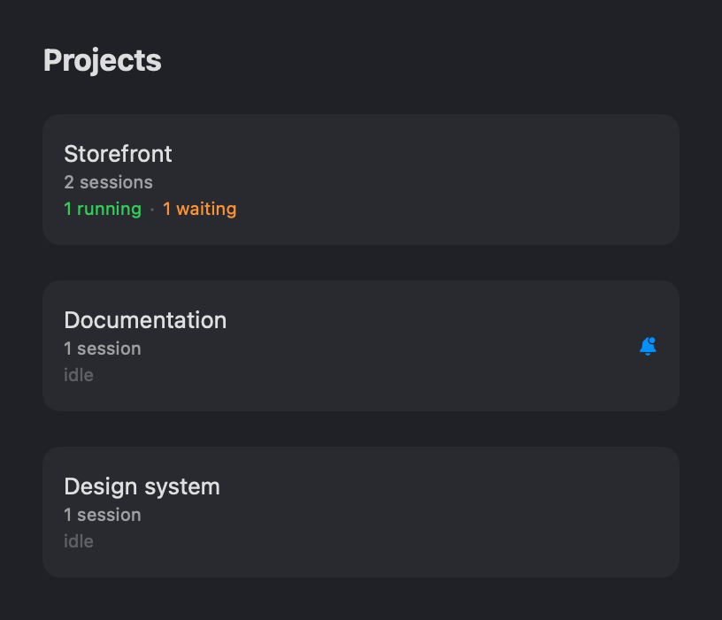
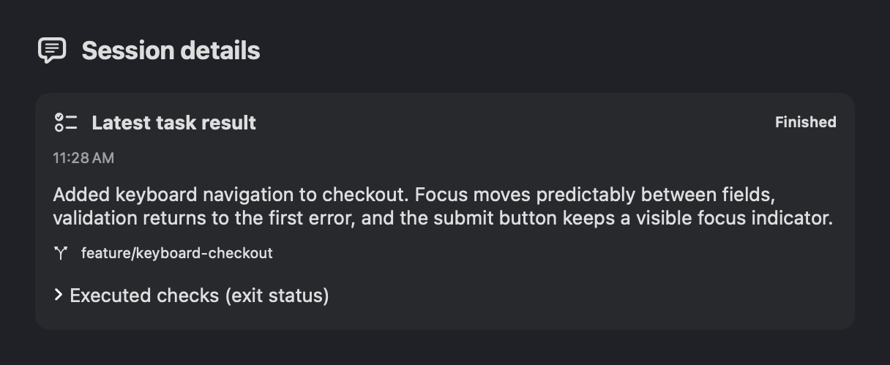

# Copilot Projects

A native macOS terminal workspace for keeping coding-agent sessions organized.
Projects live in the sidebar, sessions live in tabs, and status indicators tell
you what is running, what needs input, and what finished while you were away.

<table>
  <tr>
    <td></td>
    <td></td>
  </tr>
</table>

Current native UI previews with illustrative sample data—not a full-window screenshot.

## Install

Requires **macOS 26 or later on Apple Silicon**.

Download the latest `Copilot-Projects-<version>.dmg` from
[Releases](https://github.com/sirfergy/copilot-projects/releases), open it, and drag
**Copilot Projects** into **Applications**. Published release builds are Developer
ID–signed, notarized, and stapled.

This repository builds the **standalone desktop app**. Web access, mobile-client
connectivity, tunnel authentication, and remote push delivery are maintained and
built separately; they are not included in the public desktop distribution.
If you already use a remote-enabled installation, keep using its integrated
distribution rather than replacing it with the standalone download.

## A workspace for parallel work

- **Projects and tabs.** Group sessions by project without juggling terminal
  windows. Background tabs keep running while you work elsewhere.
- **Attention at a glance.** Running and waiting indicators, unread markers,
  and native notifications help you find the session that needs you.
- **Session details.** Read completed turns as Markdown, inspect the latest
  task result, and see usage, background agents, and schedules when the
  connected Copilot CLI supports them.
- **Local pull-request reviews.** The shield button opens a Copilot CLI session
  with a local adversarial-review prompt for a GitHub pull request.
- **Resumable terminals.** The bundled `dtach` backend keeps shells and agents
  alive when the app quits or relaunches. You can also reattach over SSH.

Copilot CLI hooks and a local tracker supply automatic status and session
details. Other command-line tools work as ordinary terminal sessions and can
report status through the CLI.

## Everyday controls

| Action | Shortcut |
|---|---|
| New project | `⌘N` |
| New session | `⌘T` |
| Close the current session | `⌘W` |
| Next / previous session | `⌃Tab` / `⌃⇧Tab` |
| Jump to a project | `⌘1`–`⌘9` |
| Jump to a session | `⌃1`–`⌃9` |

Hold `⌘` or `⌃` to reveal numbered navigation hints. Use the session-details
button to open the completed-turn drawer.

**Closing a tab ends that session. Quitting the app does not**, when the bundled
`dtach` backend is available. Closing the last window quits by default; enable
**Keep Running When Window Closes** to leave the host in the menu bar.
Plain-shell scrollback does not survive a detach; full-screen tools can repaint
when reattached.

## Command-line access

On first launch, the app installs a launcher at `~/.local/bin/copilot-projects`.
Add that directory to your `PATH` if needed.

```bash
copilot-projects ping
copilot-projects list-projects
copilot-projects list-status
copilot-projects new-session --project <id> --cwd /path/to/repo
copilot-projects focus --session <id>
copilot-projects doctor
```

Commands inside an app-managed terminal automatically target its current
project and session. Hooks for other agents can use:

```bash
copilot-projects set-status running
copilot-projects set-status waiting --text "needs approval"
copilot-projects notify "Build finished"
copilot-projects set-status idle
```

For SSH reattachment:

```bash
ssh you@mac
copilot-projects ls
copilot-projects attach <id-or-prefix>
```

Use `Ctrl-\` to detach without ending the session.

## Build and contribute

Requires Xcode 26 or later and macOS 26 or later.

```bash
git clone https://github.com/sirfergy/copilot-projects.git
cd copilot-projects
./scripts/build-app.sh --launch
```

The app uses [SwiftTerm](https://github.com/migueldeicaza/SwiftTerm) for terminal
rendering, with Metal and a CoreGraphics fallback. Local builds use an available
Developer ID identity, falling back to ad-hoc signing. Ad-hoc builds do not
preserve the signing identity of a published release.

```bash
swift test --package-path Packages/SessionDomain
./scripts/check-tracker.sh
python3 scripts/test-release.py
swift test
```

See the [usage and development guide](docs/usage.md) for hook behavior, tracker
upgrades, troubleshooting, rendering, and release instructions.

## Storage and integrations

Workspace state and session artifacts live under
`~/.local/state/copilot-projects/`. The local control socket is restricted to the
current user. Review terminal contents, transcripts, notifications, and screenshots
before sharing them; they can contain the work you are doing.

The public `CopilotProjectsHost`, `CopilotProjectsProtocol`, and
`CopilotProjectsUI` package products support separately built integrations without
making the desktop depend on a private repository. The standalone app reports
remote commands as unavailable and leaves existing remote settings unchanged.

## License

[MIT](LICENSE). The bundled `dtach` helper is licensed under GPLv2; its source is
included in [`vendor/dtach`](vendor/dtach).
